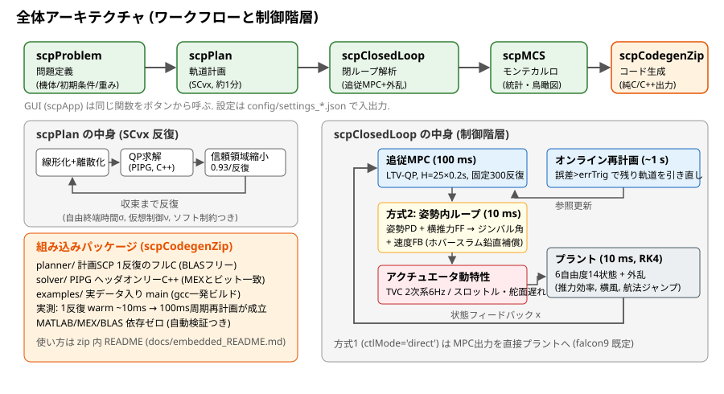
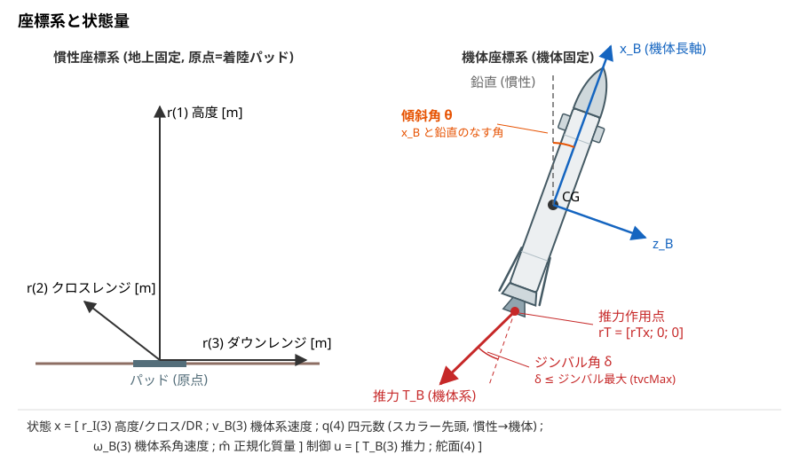
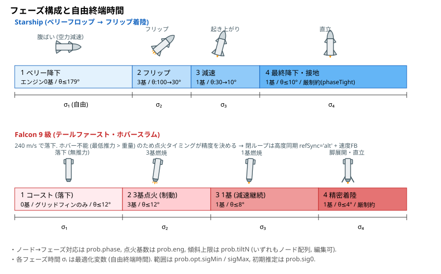
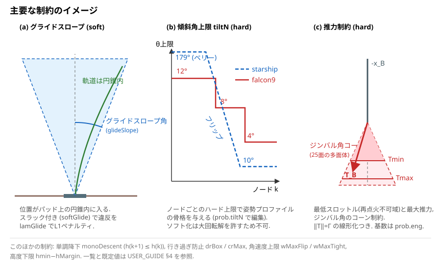
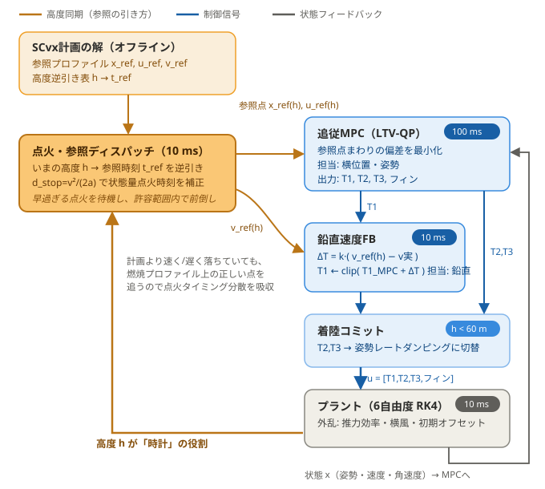
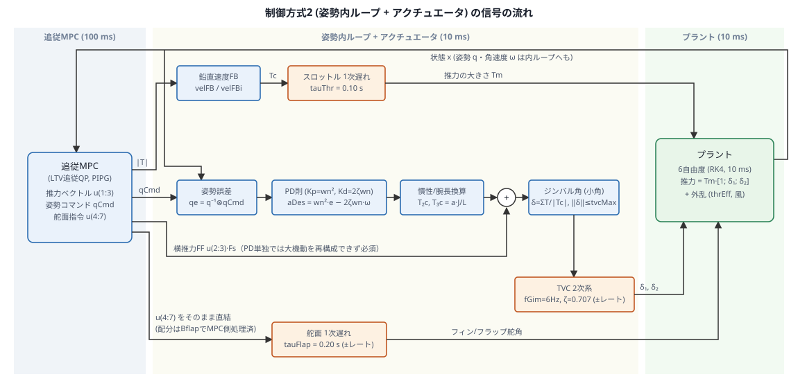

# ユーザーガイド — SCP着陸設計ツールキット

再使用ロケットの着陸を、**軌道計画（SCP/SCvx）→ 追従制御（MPC）→ モンテカルロ →
組み込みCコード生成**まで一気通貫で設計・評価する MATLAB ツールキットです。
Starship 型（ベリーフロップ→フリップ）と Falcon 9 型（ホバースラム）の2機体を
テンプレートとして同梱し、**独自機体の諸元を入れて着陸を設計する**ことを想定しています。

本書は「何も知らないユーザー」が使い始めるためのガイドです。数式・アルゴリズムの
詳細は [SCP_formulation.md](SCP_formulation.md)、生成Cコードの使い方は
[embedded_README.md](embedded_README.md) を参照してください。

## 目次

1. [インストールとクイックスタート](#1-インストールとクイックスタート)
2. [座標系と状態・制御ベクトル](#2-座標系と状態制御ベクトル)
3. [フェーズ構成と自由終端時間](#3-フェーズ構成と自由終端時間)
4. [制約のイメージと計画パラメータ（prob.opt）](#4-制約のイメージと計画パラメータprobopt)
5. [追従MPCパラメータ（prob.track）](#5-追従mpcパラメータprobtrack)
6. [閉ループ・MCS・変動定義](#6-閉ループmcs変動定義)
7. [機体パラメータ（諸元と派生量）](#7-機体パラメータ諸元と派生量)
8. [APIリファレンス](#8-apiリファレンス)
9. [JSON設定ファイル](#9-json設定ファイル)
10. [トラブルシューティング](#10-トラブルシューティング)

---

## 1. インストールとクイックスタート

要件:

| 必須/任意 | 内容 |
|---|---|
| 必須 | MATLAB R2024b 以降 |
| 必須 | MinGW-w64 コンパイラ（アドオンから無償導入。C++ソルバMEXのビルド） |
| 任意 | MATLAB Coder（組み込みCコード再生成时のみ） |
| 任意 | Parallel Computing Toolbox（MCS並列実行時のみ） |

```matlab
cd <プロジェクトフォルダ>
setup                 % パス設定 (セッション開始ごとに1回)
example_falcon9       % 通しワークフロー: 問題設定→計画→閉ループ→MCS→(コード生成)
example_starship      % 同, Starship版
scpApp                % GUI版 (同じ機能をボタンで実行)
```

examples/ の2スクリプトが最良の入門書です。節ごとにコメントで
「何を・なぜ・どう変えるか」を記載しています。



---

## 2. 座標系と状態・制御ベクトル



| 記号 | 内容 | 単位 |
|---|---|---|
| `r_I = x(1:3)` | 慣性位置 **[高度; クロスレンジ; ダウンレンジ]**。原点=着陸パッド | m |
| `v_B = x(4:6)` | **機体系**速度。`v_B(1)` は機体x軸方向（直立時は鉛直） | m/s |
| `q = x(7:10)` | 四元数（**スカラー先頭** `[q0;q1;q2;q3]`）。`R(q)` は**慣性→機体**の回転 | - |
| `ω_B = x(11:13)` | 機体系角速度 | rad/s |
| `m̂ = x(14)` | 正規化質量（`m/m0`。初期=1、乾燥質量で `mhatMin`） | - |
| `u(1:3) = T_B` | 機体系推力ベクトル（`u(1)`が軸方向）。無次元（×`cfg.Fs`でN） | - |
| `u(4:7)` | 舵面偏差（ベリーフラップ4枚 / グリッドフィン4枚、トリムからの偏差） | rad |

- **傾斜角 θ** = 機体x軸と鉛直のなす角。`θ = acos(1 − 2(q3²+q4²))`
- 直立姿勢は `q=[1;0;0;0]`、ベリー（腹ばい）姿勢は約90°
- 内部では長さ1000m・時間10s・速度100m/sで無次元化されます（`cfg.sc`）。
  API の入出力（`prob.x0`, `sol.r` など）は**物理単位**です

---

## 3. フェーズ構成と自由終端時間



計画は複数フェーズのノード列（合計 N ノード）で構成され、各フェーズの時間 σᵢ
自体が最適化変数です（自由終端時間）。ユーザーが編集するのは次の3配列:

| フィールド | サイズ | 内容 |
|---|---|---|
| `prob.phase` | 1×N | 各ノードのフェーズ番号（1,2,3,4,...） |
| `prob.eng` | 1×N | 各ノードの点火エンジン基数（0=無推力） |
| `prob.tiltN` | 1×(N+1) | 各ノードの傾斜角上限 [rad]（姿勢プロファイルの骨格） |
| `prob.sig0` | 1×P | 各フェーズ時間の初期推定 [s] |
| `prob.opt.sigMin/sigMax` | 1×P | 各フェーズ時間の下限/上限 [s] |

---

## 4. 制約のイメージと計画パラメータ（prob.opt）



### 設計思想: 許容誤差ベース

重み行列を細かく調整する代わりに、**「1単位ずれたら同じくらい困る量」= 許容誤差
`tol.*`** で問題を記述します。内部では各量を許容誤差で割った座標で解くため、
数値条件が自動的に整います。**チューニングで触るのは基本的に
tol.*（優先度）/ lam*（ソフト制約の硬さ）/ 物理制約 / passes（多段求解）の4種だけ**です。

### prob.opt 全パラメータ

**既定値の読み方**: 表の「既定」は基礎設定 (`scpk.planOptions6`) の値です。
機体テンプレート `scpProblem('starship'/'falcon9')` はこの上に機体向けの値を
上書きするため、その場合は「(機体テンプレートでは …)」と併記しています。
独自機体を設計するときは、近いテンプレートの値が実用的な出発点です。

**許容誤差（スケーリング＝優先度。小さくするほどその量を重視）**

| フィールド | 既定 | 単位 | 内容 |
|---|---|---|---|
| `tol.pos` | 5 | m | 位置 |
| `tol.vel` | 0.5 | m/s | 速度 |
| `tol.quat` | 0.005 | - | 四元数成分（小角で約0.57°） |
| `tol.rate` | 2 | deg/s | 角速度 |
| `tol.mass` | 100 | kg | 質量 |
| `tol.thr` | 20e3 | N | 推力 |
| `tol.flap` | 2° | rad | 舵面 |
| `tol.sig` | 1 | s | フェーズ時間 |

**目的関数・ペナルティ**

| フィールド | 既定 | 内容 |
|---|---|---|
| `wFuel` | 1 (機体テンプレートでは 15-25) | 燃料重視度（終端質量の最大化） |
| `wTilt` | 0 (falcon9テンプレートでは 0.1) | 傾斜の2次正則化。直立想定ノード（tiltN≤20°）のみに効く。0だと鉛直降下できる場面でも傾いた解が選ばれることがある。大きすぎると求解が不安定になるため 0.05-0.5 を推奨 |
| `wFlap` | 0 (falcon9テンプレートでは 0.5) | **舵面使用の2次正則化**。0だと最適化が舵面をレート制限いっぱいのバンバン動作で振り回し、姿勢が5〜15°振動する不自然な計画になる（0.5で舵角±20°往復→max3.4°・飛行中傾斜max3.5°、無風MCS 80→95%、実測）。強すぎる値（2.0）は分散補正まで殺し全ラン失敗。風況プロファイル使用時は風上リーンの保持に大きな定常フィントリムが必要なため `scpWindTune` が0へ解除する |
| `lamVC` | 1e6 | 仮想制御のL1ペナルティ（厳密ペナルティ。最終的に0になること） |
| `lamTerm` | 1e3 (テンプレートの passes で 1e8 まで段階増) | 終端条件のL1ペナルティ |
| `lamGlide` | lamTerm | グライド/傾斜スラックのL1ペナルティ（softGlide時） |
| `reg` | 1e-2 | 全変数の一様正則化 |

**経路制約**

| フィールド | 既定 | 内容 |
|---|---|---|
| `tiltMaxNode` | (prob.tiltN から自動) | ノード別傾斜上限 [rad]（ハード） |
| `glideSlope` | 20° | グライドスロープ半頂角。phaseTight 以降のノードにのみ課す（softGlide時スラック付き） |
| `tiltMax` | 10° (falcon9テンプレートでは 6°) | phaseTight 以降に課す傾斜角円錐の上限。ノード別スケジュール `tiltN` とは別枠の追加制約（softGlide時スラック付き） |
| `softGlide` | false (両機体テンプレートでは true) | グライド/傾斜の状態制約をスラック付きソフトにする。**ハードのままだと初期推定が円錐外の時にQPが実行不可能になる**ため true 推奨 |
| `monoDescent` | false (両機体テンプレートでは true) | 単調降下 h(k+1) ≤ h(k)（再上昇の禁止） |
| `drBox` | [] | ダウンレンジの許容範囲 [min max] [m]（行き過ぎ防止） |
| `crMax` | 0=無効 | クロスレンジの往復幅上限 [m] |
| `hMargin` | 20 (falcon9テンプレートでは 3) | 高度下限= hmin−hMargin [m]。大きすぎると計画終端が接地判定高度と整合しなくなり、接地速度を過小評価した解になるため注意 |
| `wMaxFlip` / `wMaxTight` | 60° / 10° /s | 角速度上限（phaseTight より前 / 以降） |
| `phaseTight` | 3 | **最終進入区間の開始フェーズ番号**。全制約をハード化するのではなく、このフェーズ以降のノードに限って次を適用する: (1) グライドスロープと `tiltMax` の傾斜円錐制約を**追加**（softGlide=true ならスラック付きソフト）、(2) 角速度上限を wMaxFlip → wMaxTight に切替、(3) `thrMaxTight` 指定時は推力上限を絞る。ハード/ソフトの別は softGlide が決め、phaseTight は「どこから適用するか」の指定 |
| `thrMaxTight` | 未設定=絞りなし (starshipテンプレートでは 0.9) | phaseTight 以降の推力上限の絞り率（着陸直前の浮き上がり防止） |
| `bellyHold` / `qBelly` | 0 / [1;0;0;0] | 指定フェーズまで姿勢を qBelly 近傍に保持（ベリー降下用） |
| `rateLim` | true | アクチュエータレート制約。ノード間の制御変化に 舵面: \|Δδ\|≤flapRate·dt、推力方向: \|ΔT₂,₃\|≤N_E·Tmax1·tvcRate·dt（小角近似）を課す。点火基数が変わる境界は除外 |

**推力制約**

| フィールド | 既定 | 内容 |
|---|---|---|
| `nCone` | 25 | ジンバル角コーンの多面体近似の面数 |
| `coneHalf` | 25° | 推力方向コーンの半頂角 |
| `coneShrink` | 0.99 | コーンの収縮率 |
| `lcTol` | 0.05 | ‖T‖=Γ 線形化の許容 |

**信頼領域（境界方式）とSCP反復**

| フィールド | 既定 | 内容 |
|---|---|---|
| `trX` / `trU` / `trSig` | 20 / 10 / 2 | 状態/制御/σ の変化幅（許容誤差単位） |
| `trShrinkRate` | 0.80 (機体テンプレートでは 0.93) | 反復ごとの収縮率 |
| `trXmin` / `trUmin` / `trSigMin` | 0.5 / 0.3 / 0.05 | 収縮の下限 |
| `maxIter` | 15 | SCP最大反復数 |
| `tolStep` | 1e-2 | ステップ収束判定 |
| `sigMin` / `sigMax` | 0.5 / 30 | フェーズ時間の範囲 [s]（スカラーまたはフェーズ別） |
| `useCpp` | 未設定=無効 (機体テンプレートでは true) | C++ソルバMEXを使う（未ビルド時は自動フォールバック） |
| `verbose` | false | 反復ログ表示 |
| `qp.*` | §8 qpOptions | QPソルバ（PIPG）設定。`qp.maxIter` 6000-8000, `qp.omega` 1e2(Ruiz併用時) |

### 多段求解 `prob.passes`（継続法）

厳しい終端条件をいきなり課すと収束しなかったり質の悪い局所解に落ちるため、
**緩い設定で一度解き、その解を初期値（ウォームスタート）にして条件を段階的に
厳しくしながら解き直す**、という最適化の標準手法（継続法, continuation）を使います。
`prob.passes` はその「段階」の列で、struct配列の各要素が1回の解き直しに対応します:

```matlab
% 例 (falcon9テンプレート): 終端重み lamTerm を3段階で強める
prob.passes(1).set = struct('lamTerm',1e7);          % 1段目: この項目だけ上書きして解き直し
prob.passes(2).set = struct('lamTerm',5e7, ...       % 2段目: さらに強め、フェーズ時間範囲も変更
                            'sigMax',[9 5.5 9 5]);
prob.passes(3).set = struct('lamTerm',1e8);          % 3段目: 最終精度
prob.passes(2).sigma = [7.5 4 4 1.8];                % (任意) フェーズ時間の初期値の差し替え
```

`scpPlan` は「基本設定で1回（コールドスタート）→ passes(1) → passes(2) → …」と
順に実行します。`.set` に書いたフィールドだけが上書きされ、他は前段から引き継がれます。
機体テンプレートに実績のある段階構成が入っているので、それを出発点に調整してください。

---

## 5. 追従MPCパラメータ（prob.track）

計画軌道を参照として100ms周期で解く LTV-MPC の設定です（`scpk.track6Options`）。

**許容誤差 `tol.*`**: §4 と同じ「1単位ずれたら同じくらい困る量」によるスケーリングを、
追従層では**計画からの偏差**に適用します。計画層より小さい値（＝偏差に厳しい）が既定です。

| フィールド | 既定 | 単位 | 内容 |
|---|---|---|---|
| `tol.pos` | 2 | m | 位置偏差（計画層の 5 m より厳しめ） |
| `tol.vel` | 0.3 | m/s | 速度偏差 |
| `tol.quat` | 0.01 | - | 姿勢（四元数成分）偏差 |
| `tol.rate` | 2 | deg/s | 角速度偏差 |
| `tol.mass` | 500 | kg | 質量偏差（大きい値＝追従ではほぼ無視する） |
| `tol.thr` | 50e3 | N | 推力偏差 |
| `tol.flap` | 5° | rad | 舵面偏差 |

**ホライズン・重み・ソルバ**

| フィールド | 既定 | 内容 |
|---|---|---|
| `H` / `dt` | 25 / 0.2s | 予測ホライズン節点数と間隔（H×dt=5s。位置は姿勢を経由した二重積分応答のため、5秒程度の先読みが必要） |
| `wPos` / `wVel` | 8 / 2 | 位置/速度の追従重み |
| `wQuat` / `wRate` | 1 / 0.5 (falcon9テンプレートでは 2.5 / 2.0) | 姿勢/角速度（傾斜ふらつき抑制に効く） |
| `wTerm` | 10 | 終端コストの重み倍率。予測区間の**最後の時点（5秒後）の偏差だけ**を、通常の重み（wPos等）の wTerm 倍で罰する。大きいほど「ホライズンの終わりまでに参照へ戻り切る」ことを重視し、引き戻しが強くなる（MPCの標準的な終端コストに相当） |
| `rCtrl` | 0.5 (falcon9テンプレートでは 0.8) | 制御偏差ペナルティ（大きい=滑らか） |
| `useCpp` | true | C++ソルバ使用 |
| `fastQP` | true | 固定300反復モード（決定的 ~9ms）。false で収束判定モード |
| `qp.maxIter` | 2500 (falcon9テンプレートでは 4000) | 反復上限（fastQP=false時） |
| `qp.omega` | 1e4 | PIPGゲイン比（追従層ではRuiz前処理を使わない: 周期ごとにスケールが変わりウォームスタートの効果が失われる） |

---

## 6. 閉ループ・MCS・変動定義

### ホバースラム制御器の構造（falcon9）



高度 h が「時計」の役割を果たすのが要点です。点火ディスパッチが h から参照点を
逆引きし（refSync='alt'）、MPC は横位置・姿勢を、鉛直速度FBは v_ref(h) への
推力トリムで鉛直タイミングを受け持ちます（役割分担の詳細は下表の各パラメータ）。

### プラントと制御方式・アクチュエータモデル

閉ループでは、真値モデル（プラント）を 10 ms 周期の RK4 で積分します。プラントの
力学は計画と同じ `dynamics6` ですが、**外乱が乗ります**: 実推力 = 指令 × `thrEff`
（推力効率誤差）、横風の等価加速度 `windY`、初期オフセット `dr0`/`dvB0`、および
MCS指定時の機体諸元変動（§6後述）。

MPCの指令がプラントに届くまでの経路は**制御方式**で変わります:

- **方式1** `ctlMode='direct'`（falcon9既定）: MPCの推力ベクトル・舵面指令を
  **そのまま**プラントに印加します（理想アクチュエータ。遅れなし）。
  ホバースラムでは鉛直速度FB（`velFB`）による推力トリムだけが10ms層で加わります。
- **方式2** `ctlMode='inner'`（starship既定）: MPCは推力の大きさ・目標姿勢・舵面を
  出し、10 ms の姿勢内ループ（PD + MPC横推力のフィードフォワード）がジンバル角
  指令を作ります。その指令が下表の**アクチュエータモデル**を通ってからプラントに
  入るため、応答遅れの影響を含めた評価になります。

**方式2の内ループ構造（ブロック線図）**:



信号の流れ: MPC（100 ms）は推力ベクトル・**姿勢コマンド qCmd**（次節点で取るべき
四元数）・舵面指令を出します。10 ms の内ループでは、(1) 推力の大きさは鉛直速度FBで
トリム後スロットル1次遅れへ、(2) ピッチ・ヨーは姿勢誤差 qe=q⁻¹⊗qCmd をPD則
（Kp=wnAtt², Kd=2·ztAtt·wnAtt）で目標角加速度にし、慣性÷推力腕長で必要横推力に
換算、**MPC横推力のフィードフォワードと加算**してからジンバル角（小角近似、
±tvcMax飽和）に変換しTVC 2次系へ、(3) フィン/フラップは配分計算をせず MPC の
最適化出力をそのまま1次遅れで追従させます（ロール/ピッチ/ヨーへの配分は効き行列
Bflap を通じて MPC 側で済んでいるため。ロール軸は単発ジンバルでは作れずフィンが
受け持ちます）。横推力FFが無いとPD単独ではフリップ級の大機動モーメントを再構成
できず破綻します（実測）。生成コードでは guidance/gnc_attitude.c が同一実装です。

**方式2のアクチュエータモデル**（前進オイラー 10 ms で積分）:

| アクチュエータ | モデル | 設定（§6 prm表） | 既定 |
|---|---|---|---|
| スロットル（推力の大きさ） | 1次遅れ | `tauThr` [s] | 0.10 |
| TVC（ジンバル角2軸） | 2次系（固有周波数・減衰比） | `fGim` [Hz] / `ztGim` | 6 / 0.707 |
| 舵面（フラップ/グリッドフィン4枚） | 1次遅れ | `tauFlap` [s] | 0.20 |
| （オプション）スルーレート飽和 | 角速度のハード制限 | `actRateLim` + 機体諸元 `tvcRate`/`flapRate` | 無効 |

ジンバル角は `tvcMax` で常に飽和します。エンジン停止区間（`prob.eng`=0）は推力ゼロが
強制されます。着陸コミット域（`latFreezeAlt` 以下）では方式1は横推力を姿勢レート
ダンピングに、方式2は姿勢コマンドを直立へフェードし横推力FFを絞ります（接地間際の
姿勢・レートの乱れを防ぐ。共通の思想）。

**方式2とホバースラム機の相性**: falcon9型では、スロットル1次遅れ（0.1 s）が
ホバースラムの制動タイミング精度を直接損なうため、方式2は方式1より分散に弱く
なります（風＋3σ分散のMCSで方式1 75% vs 方式2 50%（`thrLead=0.5`適用時）、実測）。
公称性能は方式2でも十分出ます（風あり12 m級）が、**ロバスト性評価は方式1を推奨**
（falcon9テンプレートが方式1既定なのはこのため）。方式2はアクチュエータ遅れの
影響評価・内ループ設計の検討用と位置づけてください。なお**計画のレート制約（§4 `rateLim`）はノミナル軌道の実現可能性を
保証するだけ**で、閉ループのフィードバック補正はその上に上乗せされるため、
`actRateLim` を有効にする場合は §6 prm表の注意（必要舵速度の目安）を参照してください。

### 大気モデルと風

**大気は既定で ISA 標準大気**です。密度は着陸パッドの標高 `hPad` + 高度から
対流圏の ISA 式で計算されます（0–11 km、それ以上はクランプ）:

```
T = 288.15 − 0.0065 h [K],   ρ = 1.225 (T/288.15)^4.2561 [kg/m³]
```

機体諸元（派生量）の `atmIsa`（1=ISA / 0=一定密度）と `hPad` [m] で切り替えます。
一定密度モード（`atmIsa=0`）では従来どおり `rho` の値がそのまま使われます。
ISA モードでは `rho` は空力係数の基準密度で、力学では高度ごとの密度比が掛かる
ため、**実効的な空力は ISA 密度そのもの**になります（`rho` の値には依存しません）。
大気モデルは**計画・追従MPC・プラントすべてに共通**で入ります。

**風は2系統**あります:

- **風況プロファイル `windProf`**（推奨・物理モデル）: 高度に対する風速の折れ線
  `struct('h',[m],'wy',[m/s],'wz',[m/s])`（wy=クロスレンジ、wz=ダウンレンジ、
  慣性系）。プラントの空力が**対気相対速度** v − w で評価されます。プロファイル
  範囲外の高度は端の値でクランプ。JSONから読むには:

  ```matlab
  prob.windProf = loadWindProfile('config/wind_shear_example.json');
  R = scpClosedLoop(prob, struct());
  ```

  MCS では `windScale`（プロファイル全体への乗率、公称1）を変動させることで
  風の強さの分散を表現できます。
- **等価加速度 `windY`**（簡易・旧来互換): 機体に一定の横加速度 [m/s²] を加える
  簡易外乱。プロファイルと併用できます。

`prob.windProf` を設定して計画すると、**風は計画・追従MPCのモデルにも入ります**
（8点テーブルに再標本化してフィードフォワード。横方向の箱制約 crMax/drBox は
風ドリフト推定ぶん自動拡張されます）。コーストなど制御力の無い区間の風ドリフトは
フィードバックでは取り返せないため、既知の平均風は計画に織り込み、`windScale`
などの変動分だけをフィードバックと再計画が吸収する構成が推奨です。

**強風時の注意（特にホバースラム機）と強風チューニング `scpWindTune`**

まず前提として、テールファースト機（falcon9型）が横位置を直す手段は「機体を
傾けること」しかありません。機体下端のジンバルで推力を横に向けても、推力線が
重心を外れるため機体が回転してしまい、主推力はむしろ逆を向きます（ドローンと
同じで、横に動くにはまず傾く必要がある、と考えてください）。したがって
**横風に対抗する能力は「どれだけ速く・どれだけ大きく傾いてよいか」という
計画の姿勢制約で決まります**。既定のテンプレートはこれらを無風時の滑らかさ
優先で絞っているため、クロス風 7 m/s を超えると着陸精度が数十mに悪化します。

`scpWindTune(prob)` は次の4つの制約を緩和します。それぞれの意味と理由:

| 変更するパラメータ | 既定 → 変更後 | 意味となぜ効くか |
|---|---|---|
| `opt.wMaxFlip` / `opt.wMaxTight`（計画が許す機体の**回転の速さ**の上限。飛行中盤／終盤） | 6 → 15 °/s / 3 → 8 °/s | 傾ける→戻すという横修正の機動は回転の速さで律速される。遅いままだと短い燃焼時間内に修正が完了しない（これが支配要因。実測でこの緩和だけで 45→26 m） |
| `prob.tiltN`（時点ごとの機体の**傾きの上限**のスケジュール） | 燃焼フェーズを2倍（例 12→24°, 8→16°）。最終の精密着陸フェーズは据え置き | 風に逆らって横方向に加速するには、より大きく傾いて主推力の横成分を稼ぐ必要がある。接地直前だけは従来の厳しい上限を保ち、着陸姿勢を守る |
| `opt.bellyHold`（エンジン**点火前の慣性降下中に姿勢を直立に固定する制約**の許容幅） | 2 → 8（グリッドフィン機のみ） | 点火前は推力がなく、既定では姿勢も直立固定なので、風に流されるがまま（ドリフトの大半はここで蓄積する）。許容幅を広げると、機体を数度だけ風上側に傾け、高速降下（〜240 m/s）の大きな空気力の横成分でドリフトを打ち消せる。実機のグリッドフィン降下と同じ操作。これが最大の改善要因（実測 26→4.5 m）。ベリーフロップ機（starship型）は腹ばい姿勢の保持が飛行成立に必須なので変更しない |
| `track.wQuat` / `track.wRate`（追従MPCの**姿勢誤差・角速度への重み**） | 2.5/2.0 → 3.5/3.0 | 上記の緩和で計画が大きな傾き機動を含むようになるぶん、追従側の姿勢の締めを強め、接地時の傾斜の乱れを抑える |

適用は1行（GUIでは環境タブの「強風チューニング」チェックボックス）:

```matlab
prob = scpProblem('falcon9');
prob.windProf = loadWindProfile('config/wind_shear_example.json');
prob = scpWindTune(prob);
```

効果の実測（クロス風 地上5→上空10.6 m/s、falcon9、細長体空力補正後）:
計画残差 22.8 m → **13.5 m**、閉ループ 20 m級・接地 −6.3 m/s・傾斜 1.2°、
MCS（風＋3σ分散20ラン）は成功55%で**墜落級ゼロ**（最悪でも vTd 8.1 m/s・
傾斜 2.6°）。なお緩和はいずれも「機体にできることを増やす」方向の変更なので、
実際の機体でジンバル角速度や許容傾斜にハード制限がある場合は、その実力値を
超えない範囲で調整してください。

**「実機は10 m/s風で普通に降りるのに」と感じたら**: 本テンプレートのシナリオは
高度2.2 km・残り約12秒からの最終降下だけを切り出しています。実機は点火前の
数分間（エントリバーン後の空力誘導）で風ドリフトの大半を修正してから最終
バーンに入るため、残り12秒に要求される横修正はごく小さくなります。この
ツールで同じ条件に近づけるには、開始高度を上げてコースト（グリッドフィン
誘導）区間を長く取るシナリオ設計が必要です（フェーズ時間・傾斜スケジュールの
再調整が要ります）。GUI では「環境」タブで大気モデル・パッド
標高・風況プロファイル（表編集/JSON読込）を設定でき、風速分布は右側の表示タブ
「風況」に大きくプロットされます（表の編集で自動更新）。

### 閉ループの外乱・設定（`scpClosedLoop(prob, prm)` の prm）

| フィールド | 既定 | 内容 |
|---|---|---|
| `thrEff` | 0.97 | 推力効率（実推力=指令×thrEff） |
| `windY` | 0.3 | 横風の等価加速度 [m/s²]（簡易外乱。§6「大気モデルと風」参照） |
| `windProf` | [] | 風況プロファイル `struct('h','wy','wz')`。空力を対気相対速度で評価（prob.windProf からも引き継がれる） |
| `windScale` | 1 | 風況プロファイル全体への乗率（MCSの風分散用） |
| `navJump` | 0 | t=8s の航法ジャンプ [m]（位置認識が跳ぶ外乱） |
| `dr0` | [0;0;0] | 初期位置オフセット [高度;クロス;DR] [m] |
| `dvB0` | [0;0;0] | 初期速度オフセット（機体系） [m/s] |
| `errTrig` | 25 | オンライン再計画のトリガ位置誤差 [m]（inf=再計画なし） |
| `velTrig` | inf | 同、速度誤差 [m/s] |
| `dtR` | 1.0 | 再計画の最短間隔 [s] |
| `reAltMin` | 220 | 再計画を許す最低高度余裕 [m] |
| `ctlMode` | starship='inner' / falcon9='direct'（テンプレート既定） | 'direct'=方式1（MPC推力直接）/ 'inner'=方式2（10ms姿勢内ループ+アクチュエータ動特性） |
| `wnAtt` / `ztAtt` | 1.2 / 0.9 | 方式2の姿勢ループ帯域 [rad/s] / 減衰比 |
| `tauThr` | 0.10 | 方式2: スロットルの1次遅れ時定数 [s] |
| `fGim` / `ztGim` | 6 / 0.707 | 方式2: TVC（ジンバル）アクチュエータ2次系の固有周波数 [Hz] / 減衰比 |
| `tauFlap` | 0.20 | 方式2: 舵面の1次遅れ時定数 [s] |
| `thrLead` | 0 | 方式2: スロットル1次遅れの**リード補償**（0=なし、0.5〜1で補償）。ホバースラム機では遅れ0.1 sが制動タイミング精度を落とし「接地前に停止→落下」の分散を生むため、0.5程度で緩和（falcon9 方式2のMCS成功率 35→50%、実測） |
| `actRateLim` | false | 方式2: アクチュエータの**スルーレート飽和**を有効化（機体諸元 tvcRate/flapRate でハード制限）。既定は遅れ動特性のみ。**注意**: 現行の姿勢内ループ設計では tvcRate≥40°/s・flapRate≥30°/s 程度がないと閉ループが成立しない（実測。テンプレート諸元 20/15°/s のまま有効化すると発散） |
| `refSync` | 'time' | 参照同期。'alt'=高度で参照を引く（ホバースラムの点火タイミング分散を吸収） |
| `cutoffAlt` | 0（falcon9テンプレート=60） | エンジンカットオフ判定高度 [m]（接地高度からの余裕）。ホバー不能機（T/W_min>1）は接地前に減速し切ると降下再開できず上昇暴走→墜落する。この高度以下でほぼ停止したら機関停止して落下着地する（実機ホバースラムと同じ運用。分散時の墜落 −52 m/s → 落下 −12 m/s 程度に緩和、実測）。0=無効 |
| `cutoffV` | −0.5 | カットオフ判定の鉛直速度しきい値 [m/s]（これ以上=ほぼ停止/上昇で発動） |
| `velFB` / `velFBi` | 0 / 0 | 鉛直速度FBの比例/積分ゲイン（ホバー不能機のブレーキ補償） |
| `latFreezeAlt` | 0=無効 | 着陸コミット高度 [m]。以下で横推力を姿勢レートダンピング専用に切替 |
| `dtMpc` | track.dtCtrl (0.10) | 追従MPCの実行周期 [s]（dtPlantの整数倍に丸め）。予測の刻み `track.dt` とは別物。既定値は `track6Options.dtCtrl` に一元化 |
| `dtPlant` | track.dtPlant (0.01) | プラント積分と10ms層（速度FB・姿勢内ループ・アクチュエータ）の刻み [s] |
| `noSave` / `noPlot` | 0 / 0 | 保存/描画の抑制 |

`refSync, velFB, velFBi, latFreezeAlt, ctlMode, errTrig, cutoffAlt` は機体テンプレート
（scpProblem）から自動で引き継がれるため、通常は外乱系（thrEff, windY, dr0...）だけ
指定すれば十分です。なお**MCSの変動定義ファイルは機体専用**です（機体諸元を絶対値で
振るため、他機体のファイルを使うと質量等が丸ごと入れ替わり全ラン失敗します。GUIは
機体切替でファイル選択が自動追随し、不一致時は警告します）。

### MCS変動定義（config/dispersions_*.m / .json）

各行が `{名前, 分布, p1, p2}`。分布は `uniform`（p1=下限, p2=上限）、
`normal`（p1=平均, p2=標準偏差、打ち切りなし）、`normal3`（同、**±3σで打ち切り**。推奨）。

```json
[
  {"name": "thrEff", "dist": "uniform", "p1": 0.97, "p2": 1.00},
  {"name": "windY",  "dist": "normal",  "p1": 0.0,  "p2": 0.25},
  {"name": "dr0x",   "dist": "normal",  "p1": 0.0,  "p2": 8}
]
```

使える名前は3系統:

- **環境・制御系**: 上表の閉ループ prm の任意の数値項目（thrEff, windY, `windScale`（風況プロファイルの乗率）, navJump, errTrig …）
- **初期分散**: `dr0x/dr0y/dr0z`（位置: 高度/クロス/DR [m]）、`dvBx/dvBy/dvBz`（機体系速度 [m/s]）
- **機体諸元**（絶対値で指定）: 下表の名前が使える。機体諸元の変動は
  **プラント側の力学モデルだけ**に適用され、制御器は公称モデルのまま飛ぶため、
  モデル誤差に対するロバスト性の評価になる

| 機体諸元の名前 | 単位 | 内容 |
|---|---|---|
| `dryMass` / `landingProp` | kg | 乾燥質量 / 着陸用推進薬 |
| `Lb` / `R` | m | 全長 / 半径 |
| `thrustPerEng` | N | 1基あたり推力 |
| `Isp` | s | 比推力 |
| `throttleMin` / `throttleMax` | - | スロットル範囲 |
| `tvcMax` | rad | ジンバル最大角 |
| `Ixx` / `Iyy` / `Izz` | kg·m² | 慣性モーメント |
| `rTx` | m | 推力作用点の機体x座標 |
| `rho` | kg/m³ | 大気密度（一定密度モード時。ISAでは基準密度で実効影響なし） |
| `hPad` | m | 着陸パッドの標高（ISAの基準高度。高地パッドの想定に） |
| `CdAx` / `CdSide` | - | 軸/横方向の抗力係数 |
| `aeroScale` | - | 空力全体スケール |
| `LoverD` | - | 揚抗比（ベリー時） |
| `VrefSurf` | m/s | 舵面効きの同定速度 |
| `surfGain` | - | 舵面効きゲイン（計画時の効き行列への乗率） |
| `kFlapDrag` | - | 舵面軸抗力係数 |
| `wMaxDeg` | deg/s | 角速度上限 |

### 成功判定 `prob.okCrit`（ミッション要求）

各ランの接地状態を次の3項目で評価し、**3条件すべて満たせば成功（OK）**と判定します。

| フィールド | 判定量 | 算出 | 単位 | starship既定 | falcon9既定 |
|---|---|---|---|---|---|
| `okCrit.horiz` | 水平着陸誤差 | 接地位置のパッドからの距離 √(クロス²+DR²) | m | 30 | 20 |
| `okCrit.vz` | 接地速度 | 接地時の速度ベクトルの大きさ \\|v\\|（鉛直・水平の**合成ノルム**、慣性系） | m/s | 5 | 8 |
| `okCrit.tilt` | 接地傾斜 | 接地時の機体傾斜角 θ | deg | 10 | 5 |

```
成功 = (水平誤差 < horiz) AND (|v| < vz) AND (傾斜 < tilt)
```

falcon9 の既定 vz=8 は、ホバー不能機の接地速度残差を脚の衝撃吸収機構で受ける想定です。

**コマンドでの変更方法**（2通り）:

```matlab
% (1) 問題定義に機体のミッション要求として設定 (以降のMCSすべてに適用)
prob = scpProblem('falcon9');
prob.okCrit = struct('horiz',10, 'vz',6, 'tilt',3);   % 厳しめの要求に変更
mcs = scpMCS(prob, 'dispersions_falcon9.json', 20);

% (2) MCS呼び出し時に一時的に上書き (部分指定OK: 書いた項目以外は既定を維持)
mcs = scpMCS(prob, 'dispersions_falcon9.json', 20, ...
             struct('okCrit', struct('vz',3)));         % 接地速度だけ 3 m/s に
```
既定は starship: 30/5/10、falcon9: 20/8/5（ホバー不能機はクラッシュコア等での
衝撃吸収を想定）。`scpMCS(..., struct('okCrit',struct('vz',3)))` のように上書き可能。

---

## 7. 機体パラメータ（諸元と派生量）

`scpProblem(vehicle, ov)` の第2引数 `ov`（struct）で機体を差し替えます。
**未指定の派生量は一次諸元から自動計算**されます（NaN指定も自動の意味）。
GUIでは「機体」タブ＝一次諸元、「詳細諸元」タブ＝派生量です。

**一次諸元**

| フィールド | starship既定 | falcon9既定 | 単位 |
|---|---|---|---|
| `dryMass` | 85e3 | 25.6e3 | kg |
| `landingProp` | 45e3 | 8e3 | kg（着陸用推進薬） |
| `Lb` / `R` | 62 / 4.5 | 41 / 1.85 | m（全長/半径） |
| `nEngine` | 3 | 3 | 基（着陸で使う最大数） |
| `thrustPerEng` | 2.30e6 | 845e3 | N/基 |
| `Isp` | 330 | 282 | s |
| `throttleMin` / `throttleMax` | 0.40 / 1.0 | 0.57 / 1.0 | - |
| `tvcMax` / `tvcRate` | 15° / 20°/s | 8° / 20°/s | rad（ジンバル） |
| `flapMax` / `flapMin` / `flapTrim` / `flapRate` | 80°/0/40°/15°/s | 40°/0/20°/30°/s | rad（舵面。falcon9はグリッドフィン±20°） |

**アクチュエータの扱い**: 3種類に分かれます。
(1) **可動範囲・トリム**（`tvcMax`, `flapMax/flapMin/flapTrim`）は一次諸元で、
計画・追従MPCの制約（ジンバル角コーン・舵面範囲）に反映されます。
(2) **応答の速さ（動特性）**は閉ループ側の設定（§6の `tauThr`, `fGim`, `ztGim`,
`tauFlap`）で、制御方式2のときプラントに入るアクチュエータモデルとして使われます
（MCSの変動名としても指定可）。
(3) `tvcRate` / `flapRate` は**計画のレート制約**（ノード間の舵面・推力方向の
変化率制限、`opt.rateLim`）に常時使われます。さらに `prm.actRateLim=true` で
方式2のプラント側スルーレート飽和としても課せます（§6の注意を参照）。

**派生量（自動計算値の上書き。物理単位のまま指定）**

| フィールド | 自動計算（既定） | 内容 |
|---|---|---|
| `Ixx` `Iyy` `Izz` | 中実円柱近似 | 慣性モーメント [kg·m²] |
| `rTx` | −(Lb/2+1.5) / −(Lb/2) | 推力作用点の機体x座標 [m] |
| `atmIsa` | 1 | 大気モデル（1=ISA標準大気 / 0=一定密度。§6参照） |
| `hPad` | 0 | 着陸パッドの標高 [m]（ISAの基準高度） |
| `rho` | ISA(hPad) / 1.12 | 大気密度 [kg/m³]（atmIsa=1 では基準密度で実効影響なし。atmIsa=0 の既定は1.12） |
| `CdAx` / `CdSide` | starship 2.0/2.0, falcon9 0.8/**0.35** | 軸/横方向の抗力係数。`CdSide` は**側面積基準の実効横力係数**で、迎角の大きいベリーフロップ（starship）は平板値2.0が妥当だが、横滑り角が数degのテールファースト降下（falcon9）は細長体の法線力勾配 CNα≈5/rad 相当の0.35が妥当（平板値1.2は横力を3〜5倍過大評価し、常用風で非現実的なドリフト・姿勢活動を生む） |
| `aeroScale` | 0.417 / 1.0 | 空力全体スケール（実測補正） |
| `LoverD` | 0.25 / 0 | ベリー時の揚抗比 |
| `VrefSurf` | 70 / 240 | 舵面効きの同定速度 [m/s] |
| `surfGain` | 1 | 舵面効きゲイン（Bflapに乗算） |
| `Bflap` | 同定値 3×4 | 舵面効き行列 [rad/s²/rad]（丸ごと差し替え可） |
| `kFlapDrag` | 4.9018 / 0.5 | 舵面軸抗力係数 |
| `hmin_m` | 31 / 18 | 脚接地時のCG高度 [m]（計画の終端高度） |
| `wMaxDeg` | 30 | 角速度上限 [deg/s] |

制御デバイスの種別は `cfg.surfMode`（1=ベリーフラップ（腹ばい降下用の胴体フラップ, 迎角依存） / 2=グリッドフィン（軸流でも有効））。力学そのものを差し替える場合は `[f,A,B]=dyn(x,u,cfg)` の同一シグネチャで
`scpk.dynamics6` を置き換えます（CasADi生成関数もこの形式で接続）。

---

## 8. APIリファレンス

各関数は MATLAB 上で `help 関数名` でも同じ情報を参照できます。

### setup

```
setup
```
プロジェクトのパスを設定する。セッション開始ごとに1回実行。

### scpProblem

```
prob = scpProblem(vehicle)
prob = scpProblem(vehicle, ov)
```
着陸解析の問題定義を生成する。

- **入力** `vehicle`: `'starship'` | `'falcon9'`。`ov`: 機体諸元・派生量の上書き（§7）
- **出力** `prob`: フィールドは §3, §4, §5 参照。すべて編集可
- **例** `prob = scpProblem('falcon9', struct('dryMass',22e3,'Iyy',4.2e6));`

### scpPlan

```
[sol, cfg] = scpPlan(prob)
[sol, cfg] = scpPlan(prob, loadOnly)
```
軌道計画を実行する（コールドスタート＋ `prob.passes` の多段求解）。
`results/<prob.planFile>` に保存。`loadOnly=true` で保存済みを読むだけ。

- **出力** `sol.t/r/v/q/w/m`: 時刻・状態履歴（物理単位）。`sol.uhat/Tmag`: 制御。
  `sol.sigma`: フェーズ時間 [s]。`sol.tf`: 総飛行時間。`sol.propellant`: 消費推進薬 [kg]。
  `sol.virtCtrl`: 仮想制御ノルム（**0でないと物理的に無効な解**）
- **所要** 約1分（C++ MEXビルド済み時）

### scpClosedLoop

```
R = scpClosedLoop(prob, prm)
```
計画に対する閉ループ解析（追従MPC 100ms＋再計画＋外乱、プラント10ms RK4）。
prm は §6。機体テンプレートの制御設定は自動で引き継がれる。

- **出力** `R.log.t/x/u`: 履歴（物理単位）。`R.xEnd/tEnd`: 接地状態と時刻。
  `R.log.qpT/st`: MPCのQP時間と状態。`R.rp`: 再計画統計
- **例** `R = scpClosedLoop(prob, struct('thrEff',0.95,'dr0',[15;10;-20]));`

### scpMCS

```
out = scpMCS(prob, dispFile, N)
out = scpMCS(prob, dispFile, N, prm)
```
モンテカルロ解析。`dispFile` は変動定義（§6）。`prm.parallel=true` で parfor 並列、
`prm.seed` で再現。出力 `out.res(i)`: 各ランの horiz/vTd/tilt/fuel/ok/traj。
鳥瞰軌道図＋着陸精度散布＋統計を表示。

### scpCodegenZip

```
zipf = scpCodegenZip()        % 既存の生成物からパッケージ (数秒)
zipf = scpCodegenZip(true)    % コード生成からやり直し (数分,要MATLAB Coder)
```
組み込み用の**純C/C++ソースのみ**の zip を作る（MATLAB/MEX/BLAS依存ゼロ、自動検証つき）。
部品構成で、個別利用も全体での誘導制御構築も可能:
gnc/（計画SCP 1反復 `scpk_planIterEmb`・追従MPC 1周期 `scpk_trackStepEmb`・
6自由度力学 `dyn` の3エントリポイント、型共有の生成C）、guidance/（参照サンプ
リング・点火ディスパッチ・鉛直速度FBの手書きC）、solver/（PIPGヘッダオンリー）、
examples/（計画単体／追従単体／ソルバ単体／**GNC統合閉ループ**の4つの実データ
入りmain）、README。ターゲットでは例えば `gcc -O2 -Ignc -Iguidance -Iexamples
examples/main_gnc_example.c gnc/*.c guidance/*.c -lm` でビルド。

### scpApp

```
scpApp
```
GUI。機体・初期条件・詳細諸元・環境（大気モデル/パッド標高/風況プロファイル/
強風チューニング）・重み・外乱・MCSをフォームで設定し、[計画][閉ループ][再生]
[MCS][コード生成] をボタン実行。右側の表示タブは「計画」（計画解の状態量・
操作量トレンド6面図）と「閉ループ」（計画vs閉ループ比較）に分かれ、それぞれ
先頭に**接地状態サマリ表**（水平誤差・クロス/DR・鉛直/水平速度・傾斜・角速度・
残燃料。成功判定に照らして緑/赤で色分け）が表示される。[スクリプト生成]
ボタンで、現在のGUI設定と同一の解析（問題設定→計画→閉ループ→MCS）を再現する
スタンドアロンMATLABスクリプト (.m) を書き出せる。「環境」タブでは風の高度プロファイルを表で編集（またはJSON読込）でき、
風速分布は右側の「風況」タブに大きくプロット表示される。「制御」タブでは閉ループの制御パラメータ
（誘導系: 参照同期・鉛直速度FB・着陸コミット高度・エンジンカットオフ、
方式2の姿勢内ループ帯域・アクチュエータ動特性・スルーレート飽和、
MPC実行周期・プラント刻み）をフォームで調整でき、機体切替でテンプレート値に
リセットされる（各項目の対応prm名はツールチップに表示。§6のprm表と同一）。
「MCS」タブでは変動定義を
ファイル（config/dispersions_*）から使うか、GUIの表で直接編集するかを選べる。
表には設定可能な**全変動パラメータの一覧**（環境・初期分散・機体諸元）が公称値
つきで表示され、σ（または上下限）を入れた行だけが実行時に有効になる。
機体切替や「一覧リセット」で機体既定の変動値に戻り、「ファイルから取込」で
任意の定義ファイルを一覧に反映できる。
設定はJSONで保存/読込（§9。GUI表の変動定義も保存される）。

### ユーティリティ（util/）

| 関数 | 概要 |
|---|---|
| `plotClosedLoop(sol, R.log, cfg)` | 計画vs閉ループの6面図（GUIと同じ） |
| `animateVehicleAx(ax, t, X, U, cfg, opt)` | 機体3Dアニメーション。`opt.style='falcon9'` でフィン+脚、`opt.speed/fps` |
| `loadDispersions(src)` | 変動定義の読み込み（.m関数名 or .jsonパス） |
| `loadWindProfile(src)` | 風況プロファイルの読み込み（.jsonパス or struct。§6参照） |
| `plotWindProfile(ax, wp)` | 風況プロファイルの描画（GUIの風況タブと同じ） |
| `scpWindTune(prob)` | 強風向けの制約緩和レシピ（§6「強風時の注意」参照） |
| `plotPlanTrend(sol, cfg)` | 計画解の状態量・操作量トレンド6面図（GUIの計画タブと同じ） |
| `touchdownStats(sol\|xEnd, cfg)` | 接地状態の要約（位置・鉛直/水平速度・傾斜・角速度・残燃料） |
| `runClosedLoopReplan(prm)` | 閉ループ本体（scpClosedLoopの実装。単体でも使用可） |
| `codegenBuild` / `codegenPlanIter` | 生成MEX/Cの再生成（cfg/pp構造を変えた時に実行） |
| `scpCheckMex` | モデル構造体と生成MEXの整合検査＋自動再生成（scpPlanから毎回自動実行） |
| `verifyEmbedded` | 組み込みパッケージの等価性検証: zipを展開→gccビルド→実行し、計画1反復・追従MPC1周期の結果をMATLAB参照実装と同一入力で突き合わせ（実測 最大差 ~1e-11、QP反復数完全一致） |
| `scpPackageProject` | git管理用のプロジェクトzipを作成 |

---

## 9. JSON設定ファイル

GUIの[保存]/[読込]で扱う `config/settings_*.json` のスキーマ:

```jsonc
{
  "vehicle": "falcon9",             // 'starship' | 'falcon9'
  "ic":   { "alt": 2200, "downrange": -40, "cross": 0,
            "vDescent": 240, "vHoriz": 10 },              // 初期条件 [m, m/s]
  "veh":  { "dryMass_t": 25.6, "prop_t": 8, "Lb_m": 41, "R_m": 1.85,
            "nEngine": 3, "thrustPerEng_kN": 845, "Isp_s": 282,
            "throttleMin": 0.57, "tvcMax_deg": 8 },       // 一次諸元
  "der":  { "Ixx_tm2": 57.5, "Iyy_tm2": 4735.5, "Izz_tm2": 4735.5,
            "rTx_m": -20.5, "rho": 1.12, "CdAx": 0.8, "CdSide": 1.2,
            "aeroScale": 1.0, "LoverD": 0.0, "VrefSurf_ms": 240,
            "surfGain": 1.0, "kFlapDrag": 0.5, "hmin_m": 18,
            "wMax_degs": 30 },                            // 派生量 (省略=自動計算)
  "plan": { "log10LamTerm": 8, "wFuel": 15, "tolPos_m": 5, "tolVel_ms": 0.5 },
  "track":{ "ctlMode": "direct", "wPos": 8, "wVel": 2,
            "wQuat": 2.5, "wRate": 2.0, "H": 25 },   // wQuat/wRate: 姿勢ブレ抑制の重み
  "dist": { "thrEff": 0.97, "windY": 0.2, "navJump": 0, "errTrig": 40,
            "dr0": [15, 10, -20], "dvB0": [1, -1, 1.5] }, // 外乱と初期オフセット
  "env":  { "atmIsa": 1, "hPad_m": 0,                    // 大気 (1=ISA/0=一定密度)
            "wind": { "h": [0, 500, 2000],               // 風況プロファイル [m]
                      "wy": [4, 8, 11], "wz": [0, -2, -4] } },  // [m/s] (空=無風)
  "mcs":  { "N": 8, "parallel": true,
            "source": "ファイル",                        // 'ファイル' | 'GUI表'
            "dispFile": "dispersions_falcon9.json",
            "disp": [                                    // GUI表の変動定義 (source='GUI表'時に使用)
              { "name": "thrEff", "dist": "uniform", "p1": 0.97, "p2": 1.0 },
              { "name": "windY",  "dist": "normal3", "p1": 0.0,  "p2": 0.25 } ] },
  "play": { "speed": 1.5, "source": "閉ループ" }
}
```

慣性は t·m²（=10³ kg·m²）で記載します。`der` を省略すると自動計算値が使われます。

---

## 10. トラブルシューティング

| 症状 | 原因と対処 |
|---|---|
| QPが `primalInfeasible`、主残差が0.33あたりで張り付く | 状態経路制約（グライド/傾斜）がハードで初期推定が制約外。`opt.softGlide=true`（機体テンプレートでは設定済み） |
| 計画が大きく回転する・再上昇する解になる | 傾斜制約がソフト/未設定。`prob.tiltN` のハードスケジュール＋`opt.monoDescent=true`＋`drBox` |
| 鉛直降下なのに傾いた解になる | 目的関数が傾斜に対して中立なため。`opt.wTilt=0.1`（falcon9既定）を設定。大きすぎると求解が不安定になるため0.05-0.5 |
| 計画の接地速度が過小に出る | `hMargin` が大きすぎて終端が接地判定高度と不整合。数m程度に絞る |
| 追従が発散・墜落する | ホライズン不足（`track.H*dt≥5s` 必要）。または参照が粗い（内部で自動densify済み） |
| 追従のQP収束率が低い | `track.qp.maxIter` を増やす（falcon9は4000）。**Ruiz前処理は追従層では使わない** |
| ホバースラムの接地速度が要求より大きい | `refSync='alt'`＋`velFB`（falcon9テンプレートでは設定済み）。残る分は機体の推重比による物理限界 |
| 生成MEXで構造体エラー | cfg/pp のフィールド構成変更は `scpPlan` 実行時に**自動検出され再生成される**（`scpCheckMex`。数分）。手動なら `codegenBuild`/`codegenPlanIter`（フィールド**順序**に厳密） |
| 計画・閉ループが遅い | C++ MEX未ビルド。初回の `scpApp` 起動か `codegenBuild` 実行でビルド |

性能の目安（デスクトップ実測）: 計画コールド約1分 / 再計画1反復（フルC, warm）約10-30ms /
追従MPC 1周期 約15ms / 閉ループ1ラン 約20-30秒 / 生成CのBLAS残存 0件。
